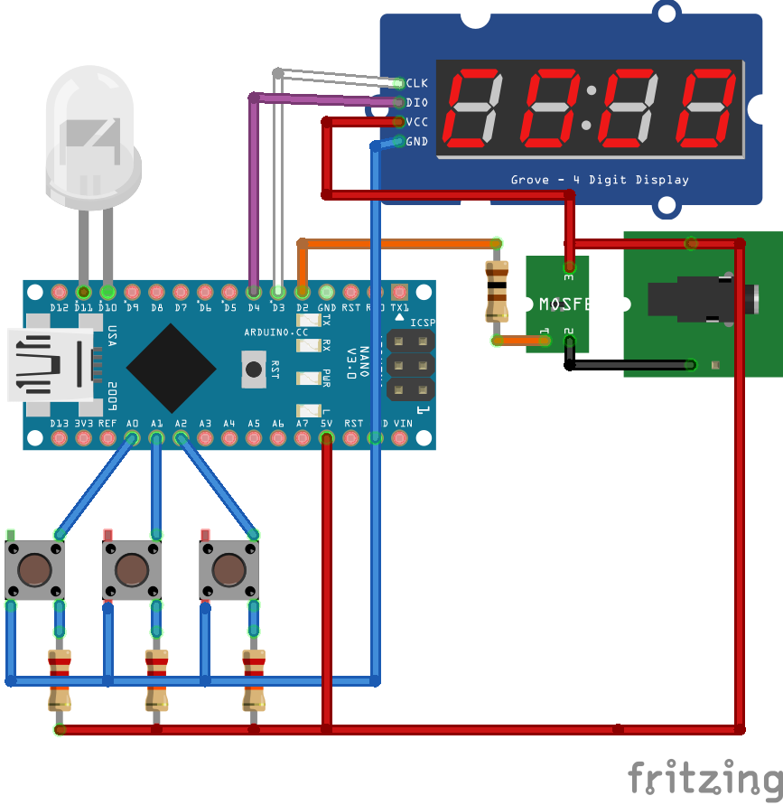
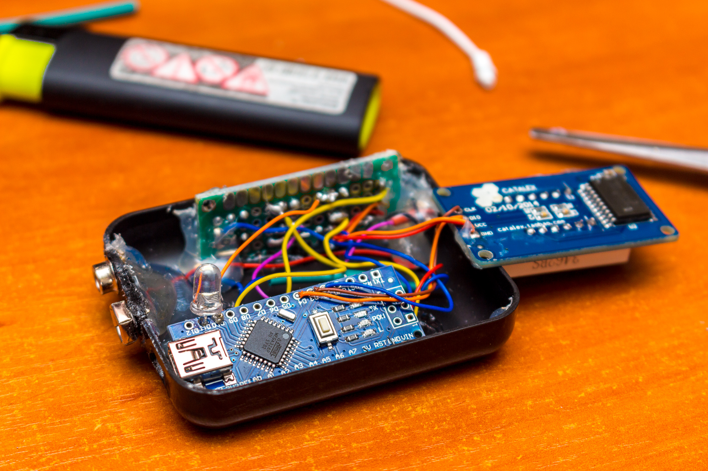
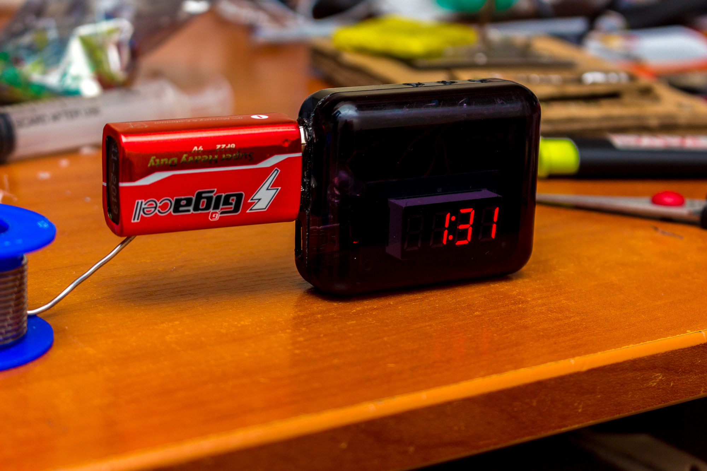
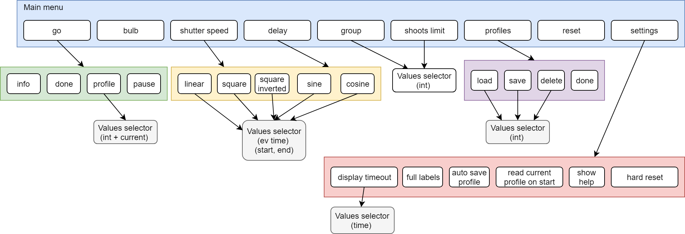
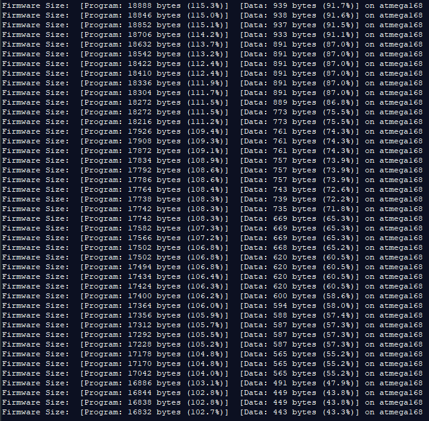

# Arduino intervalometer for SLR cameras

Intervalometer is a device that activates camera shutter with fixed rate and is mostly used for shooting timelapses.

### Functions:
   * Setting exposition and time delay
   * Number of photos limit
   * Smooth time changing:
     * Linear
     * Square
     * Inverted square
     * Sin
     * Cos
   * Shooting with groups of photos
   * Saving up to 10 profiles (with additional current profile)
   * Bulb mode
   * Opening profile while other configuration is running
   * Display timeout
   * Auto saving and reading current profile on start
   * Full/short labels

## Circuit

Used components:
* Arduino Nano v3 (Atmega328p)
* 3 x button
* 3 x pullup resistor (about 20kΩ)
* Mosfet
* 100Ω mosfet-arduino protection resistor
* 2.5mm jack connector (or what your camera needs to connect)

### Using digital output to check buttons

You can connect buttons to digital ports, change Button constructor "analog" param in main.cpp to false.

## Importing project

### Using Jetbrains CLion:
  * Install Arduino (CLion Arduino Plugin v2) plugin
  * Open project
  * Change port number in CMakeLists.txt
  * Build project with "upload" configuration

### Using Jetbrains CLion (clean install):
  * Install Arduino (CLion Arduino Plugin v2) plugin
  * Restart IDE
  * Create new Arduino sketch project
  * Copy files from git into project root folder
  * Refresh cmake project
  * Connect Arduino
  * Change port number in CMakeLists.txt
  * Build project with "upload" configuration

### Using Arduino IDE:
  * ~~Remove this useless s**t and install normal IDE~~
  * Rename "main.cpp" to "main.ino"
  * Open project (selecting ino file)
  * Connect the arduino board and upload program

## Code configuration

main.cpp (buttons, display and mosfet ports):

    #define UP 14
    #define DOWN 15
    #define SET 16
    #define TRG 2
    #define CLK 3
    #define DIO 4

ShootingTimer.h (blink led configuration):

    #define ENABLE_BLINK_LED true
    #define BLINK_LED_A_PORT 11
    #define BLINK_LED_K_PORT 10
    #define LED_BLINK_MILLIS 1  

## Manual

## What about cheaper arduino?

I spent 2 days to reduce program size to fit it in Arduino Nano (atmega 168) but... about 450 bytes left and nothing to fix/remove left.

